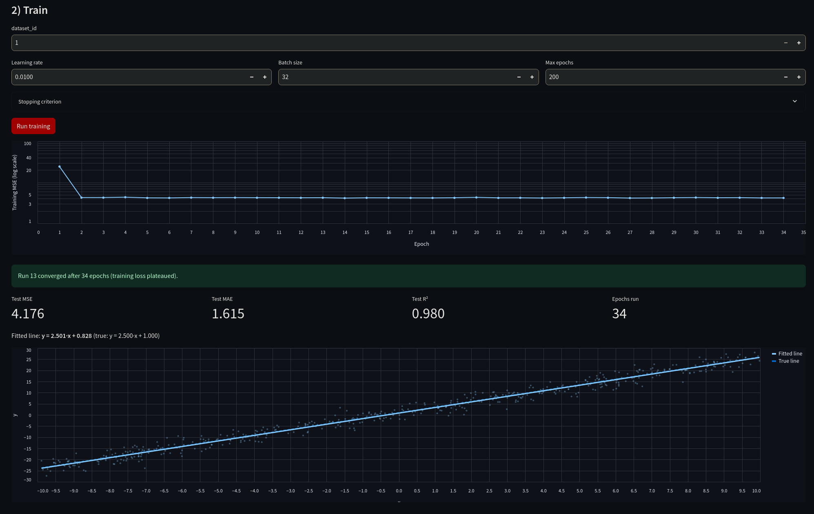
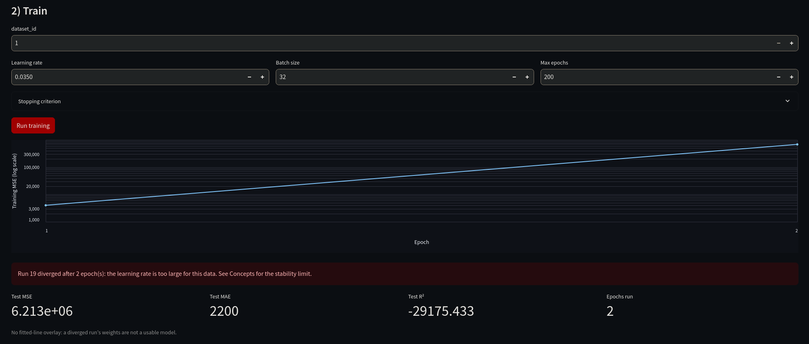

# Regress-It — A Live Linear-Regression Service

**Nicholas Drossos** · Section CST-435-WF100A · Grand Canyon University

| Tier | Platform | URL |
|------|----------|-----|
| **UI** | Streamlit Community Cloud | https://regress-it-xacun3ufjzmlqbm2bqygyk.streamlit.app |
| **API** | Render.com | https://regress-it-api-tvz3.onrender.com |
| **Data** | Supabase | https://hplsljljuracozwtvupq.supabase.co |
| **Source** | GitHub | https://github.com/Niko-Drossos/regress-it |

**Supabase project ref:** `hplsljljuracozwtvupq` — migrations in [`db/migrations/`](./db/migrations)
([`001_init.sql`](./db/migrations/001_init.sql),
[`002_run_telemetry.sql`](./db/migrations/002_run_telemetry.sql))

---

## What it does

Regress-It is an interactive demo of 1-D linear regression. You choose a learning
rate, batch size and epoch budget; the API fits `y = w·x + b` with PyTorch
mini-batch SGD on synthetic data, streams the loss back per epoch, reports
held-out MSE / MAE / R², and persists every run so configurations can be
compared later.

```
┌──────────────────────┐   HTTPS/JSON    ┌──────────────────────┐   service key   ┌──────────────────┐
│  Streamlit Cloud     │ ──────────────► │  FastAPI on Render   │ ──────────────► │  Supabase        │
│  (ui/app.py)         │                 │  (api/main.py)       │   all writes    │  Postgres        │
│  thin client, no ML  │ ◄── anon key,   │  PyTorch training    │                 │  datasets/runs/  │
│                      │  read-only ─────┼──────────────────────┼────────────────►│  predictions     │
└──────────────────────┘  SELECT on runs └──────────────────────┘                 │  (RLS on all 3)  │
                                                                                  └──────────────────┘
```

The Streamlit process contains **no model code and no SQL writes**. Its only
direct database access is one read-only `SELECT` on `runs` with the anon
publishable key, which RLS restricts to exactly that. Every training job and
every prediction is an HTTPS call to FastAPI, which owns the model and holds the
service key.

---

## Engineering report

### Decision 1: the learning rate

Squared error on a linear model is a quadratic bowl of constant curvature, so
the learning rate has a derivable ceiling. Differentiating twice gives
`∂²L/∂w² = 2·E[x²]`, and descent is stable only while the step stays under two
divided by that curvature: `η < 1/E[x²]`. The dataset draws x uniformly from [−10, 10], so
`E[x²] = 100/3 ≈ 33` and the ceiling is `η ≈ 0.030`. Deployed runs match:

| Learning rate | Outcome | Fitted slope | Test MSE | Test R² |
|---|---|---|---|---|
| 0.001 | converged, epoch 158 | 2.494 | 4.16 | 0.980 |
| 0.01 | converged, epoch 34 | 2.501 | 4.18 | 0.980 |
| 0.03 | converged, epoch 29 | 2.330 | 4.75 | 0.978 |
| 0.035 | **diverged**, epoch 2 | −422 | 6.2 × 10⁶ | −29175 |
| 1.5 | **diverged**, epoch 1 | 1.2 × 10²⁶ | null | null |

0.01 ships as the default: a third of the ceiling, leaving room for the
mini-batch gradient noise the derivation ignores, and it reaches the
least-squares answer in 34 epochs where 0.001 needs 158. 0.03 is the instructive
case — stable enough to escape the divergence guard, yet thrashing enough that
the plateau rule fires while the slope is still 2.330: a worse fit, reached
sooner.

### Decision 2: the stopping criterion

Three rules run after every epoch, in order. **Divergence:** the loss or a weight
is non-finite, or the loss exceeds 100× the untrained model's loss. **Plateau:**
the best training loss has not improved by a relative `min_delta` of 1e-4 for
`patience` = 20 epochs. **Budget:** otherwise, the epoch cap.

The divergence guard lets a failed run be recorded instead of crashing. At
lr = 1.5 the loss overflows in epoch 1; NaN and infinity map to `null` before the
insert, so the run reaches Supabase instead of returning a 500, and `/predict`
answers 409 on it — weights of 1.2 × 10²⁶ are not a model.

Patience is 20 rather than 10 because constant-rate SGD never settles; it jitters
around the optimum. At 10, runs stopped at epoch 24 with a slope of 2.390; at 20
they reach epoch 34 and land on 2.501, matching the closed-form least-squares
solution of 2.498. Ten epochs buy the difference between "stopped moving" and
"arrived."

### Decision 3: the validation split

Twenty percent is held out by a seeded permutation before the first epoch; MSE,
MAE and R² are computed on it once, inside FastAPI, then written to Supabase.
Streamlit displays those persisted numbers rather than recomputing them, so each
run has one authoritative value.

Early stopping deliberately watches the *training* loss: stopping on validation
loss would turn the split into a training signal and make the reported R²
optimistic. With two parameters overfitting is not the risk — the only question
is whether the optimizer is still improving. A converged test MSE of 4.18 against
a noise variance of σ² = 4.0 confirms the fit sits at the noise floor.

### How the run-history table makes this comparable




Every run persists its hyperparameters, stopping configuration, status, epochs run
and loss history. The Run History tab reads that table directly, and its
"Compare loss curves" chart overlays runs on one log axis: the converged curve
decays to ~4 and flattens, the diverged one leaves the top of the chart in two
epochs. Because `patience` and `min_delta` are stored per run, two runs can
also be checked for whether the same stopping rule judged them at all.

### Worldview reflection

The honest disclosure here is small and concrete. The data is generated with a
true intercept of 1.0, but the best least-squares fit this sample admits is
0.836, and every converged run reproduces it. A client shown "true 1.0, fitted
0.83" could reasonably conclude the model is broken. It is not: 500 noisy points
do not identify the intercept better, and no further training closes the gap. The temptation is to drop the true-line comparison and report only
R² = 0.98, which sounds like near-certainty.

Scripture frames the steward as one entrusted with what is not his own and judged
on faithfulness (1 Corinthians 4:2), and Proverbs 11:1 condemns the dishonest
scale: a measure built to mislead. A model reported without its limits is that
kind of scale. Honesty here is not confessing
an error; it is refusing to let a true number imply more than it can carry. So
the Model Card states the limits plainly, the UI draws the true line beside the
fitted one, diverged runs are labelled rather than discarded, and
predictions are refused on a run whose weights are meaningless. A non-technical
client cannot audit residuals; they can only trust what the engineer chose to
show, and that asymmetry is why the disclosure is owed.

---

## Tests

```bash
python -m pytest -q          # run from the repo root so it is on sys.path
```

18 tests pass offline. The Supabase round-trip test skips unless real
credentials are exported; run it against the live project with:

```bash
set -a; source .env; set +a
python -m pytest tests/test_supabase_roundtrip.py -q
```

| Required by the brief | Test |
|---|---|
| Request-schema test for `/predict` | `tests/test_schema.py` |
| Smoke test for `/healthz` | `tests/test_healthz.py` |
| Trained slope recovers ground truth | `tests/test_training.py` |
| Supabase round trip (insert → train → run row) | `tests/test_supabase_roundtrip.py` |
| Stopping criterion, divergence, determinism | `tests/test_training_stopping.py` |
| SSE telemetry, 409/503 failure paths | `tests/test_api_extensions.py` |

## API endpoints

| Method | Path | Purpose |
|--------|------|---------|
| `POST` | `/datasets` | Generate and persist a synthetic dataset |
| `GET`  | `/datasets/{id}` | One dataset with its points (for the overlay chart) |
| `POST` | `/train` | Train, persist the run, return metrics |
| `POST` | `/train/stream` | As above, streaming per-epoch loss over SSE |
| `GET`  | `/runs` | Latest 50 runs |
| `GET`  | `/runs/{run_id}` | One run, including its loss history |
| `POST` | `/predict` | Predict ŷ from a run; logs to Supabase; 409 if diverged |
| `GET`  | `/healthz` | 200 when torch and Supabase are both reachable, else 503 |
| `GET`  | `/version` | Git SHA, PyTorch version, Supabase project ref |

## Project structure

```
regress-it/
├── README.md                 # This file (engineering report above)
├── MODEL_CARD.md             # Rendered in the UI's Model Card tab
├── TUTORIAL.md               # Three-Cloud build + deploy guide
├── shared/                   # Imported by both tiers
│   ├── schemas.py            # Every request/response type (the API contract)
│   └── data.py               # Synthetic linear data generator
├── api/                      # FastAPI tier → Render
│   ├── main.py               # Endpoints
│   ├── training.py           # PyTorch loop + stopping criterion
│   ├── db.py                 # All Supabase writes (service key)
│   └── configs/default.yaml  # Default hyperparameters
├── ui/                       # Streamlit tier → Streamlit Cloud
│   └── app.py                # 5-tab thin client (no torch)
├── db/
│   ├── migrations/           # 001_init.sql, 002_run_telemetry.sql
│   └── seed.py               # Seeds the default dataset
└── tests/
```

## Running locally

```bash
python -m venv .venv && source .venv/bin/activate   # Python 3.11 or 3.12
pip install -r requirements-dev.txt

cp .env.example .env                                # API: URL + service key
cp ui/.streamlit/secrets.toml.example ui/.streamlit/secrets.toml

# Apply db/migrations/001_init.sql then 002_run_telemetry.sql in the Supabase
# SQL Editor, then seed the default dataset:
set -a; source .env; set +a
python -m db.seed

uvicorn api.main:app --reload --port 8000 --env-file .env   # terminal 1
cd ui && streamlit run app.py                               # terminal 2
```

Two notes that cost time if missed: the API does not load `.env` itself, so pass
`--env-file` (or export the vars); and Streamlit reads `.streamlit/secrets.toml`
from the *current* directory, so the UI must be started from inside `ui/`.

## Deploying

1. **Supabase** — create the project, run `001_init.sql` then
   `002_run_telemetry.sql` in the SQL Editor, then `python -m db.seed`.
2. **Render** — New → Blueprint against this repo (`render.yaml`). Set
   `SUPABASE_URL` and `SUPABASE_SERVICE_KEY` **before** the first deploy:
   `/healthz` returns a real 503 without them and the health check will fail.
3. **Streamlit Community Cloud** — deploy `ui/app.py` and paste `API_URL`,
   `SUPABASE_URL` and `SUPABASE_ANON_KEY` into the Secrets box.

`SUPABASE_SERVICE_KEY` holds the `sb_secret_` key and never leaves the API tier;
`SUPABASE_ANON_KEY` holds the `sb_publishable_` key and is safe in the browser
because RLS limits it to `SELECT` on `runs`.
